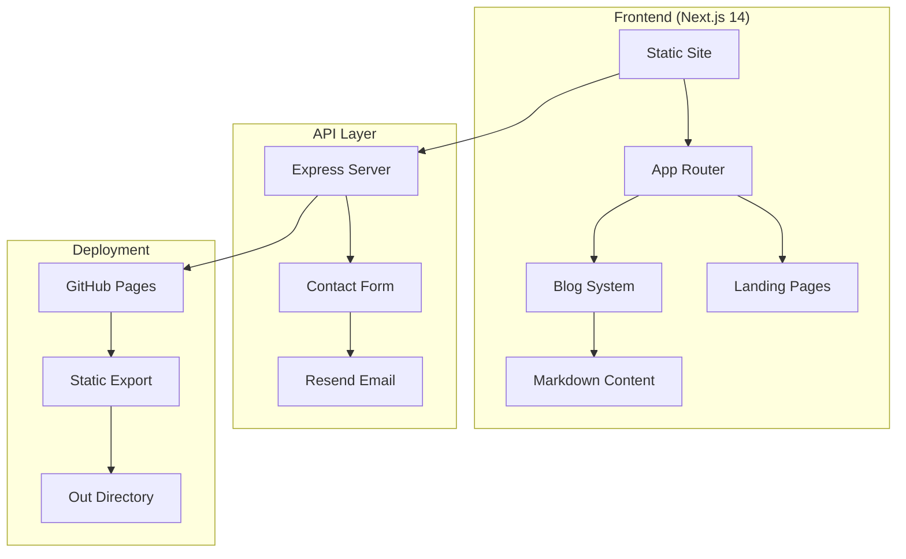

---
# CCS Metadata
name: "stuffnthings"
version: "1.0.0"
type: "website"
framework: "next.js"
deployment: "static"
context_version: "1.0"
last_updated: "2026-03-26"

# Project Overview
description: "High-Performance Digital Presence. Zero Technical Friction - Stuffnthings WaaS Platform"
purpose: "Converting from Website-as-a-Service platform to LearnHouse LMS integration"

# Technology Stack
primary_framework: "Next.js 14"
rendering: "static_export"
styling: "tailwind_css"
type_system: "typescript"
deployment_target: "github_pages"
email_provider: "resend"

# Architecture
structure: "static_site_generator"
routing: "app_router"
content_management: "markdown"
api_layer: "express_server"

# Key Features
features:
  - "Static export configuration"
  - "SEO optimized"
  - "Mobile-first responsive design"
  - "Dark theme with electric blue/emerald accents"
  - "Blog system with markdown content"
  - "Contact form with Resend email integration"
  - "Performance optimized (95+ PageSpeed target)"

# Dependencies
build_dependencies:
  - "next: ^14.0.0"
  - "typescript: ^5.0.0"
  - "tailwindcss: ^3.3.5"
  - "@tailwindcss/typography: ^0.5.19"

runtime_dependencies:
  - "react: ^18.0.0"
  - "framer-motion: ^12.36.0"
  - "gray-matter: ^4.0.3"
  - "resend: ^6.9.3"

api_dependencies:
  - "express: (in api/server.js)"
  - "cors: (for API CORS)"
---

# Stuffnthings Project Context

## Project Mission
Transform the existing Stuffnthings Website-as-a-Service platform into a comprehensive Learning Management System (LMS) using LearnHouse integration while maintaining the high-performance, zero-friction philosophy.

## Current State

### Architecture Overview


### File Structure
```
stuffnthings/
├── src/
│   ├── app/                    # Next.js App Router pages
│   ├── components/             # React components
│   ├── content/blog/          # Markdown blog posts
│   └── lib/                   # Utility functions
├── api/
│   └── server.js              # Express contact API
├── docs/                      # Project documentation
├── public/                    # Static assets
└── out/                       # Static export output
```

## Business Model Evolution

### Current: Website-as-a-Service (WaaS)
- High-performance static websites
- Zero technical friction for clients
- Performance optimization focus (95+ PageSpeed)
- Contact forms and lead generation
- Blog content management

### Target: Learning Management System (LMS)
- Course creation and delivery
- Student progress tracking
- Interactive learning content
- Assessment and certification
- Community features
- Subscription management

## Technical Configuration

### Next.js Static Export
The site uses static export configuration optimized for GitHub Pages deployment:

```javascript
// next.config.js
const nextConfig = {
  output: 'export',           // Enable static export
  trailingSlash: true,        // GitHub Pages compatibility
  images: {
    unoptimized: true,        // Static export requirement
  },
  eslint: {
    ignoreDuringBuilds: true, // Build optimization
  },
}
```

### Email Integration (Resend)
Contact forms integrate with Resend API:
- API Key: `re_HWVk1EfN_AmTNFXFicUV95eDWyZGX76aD`
- From: `info@stuffnthings.io`
- Lead notifications + auto-replies
- HTML email templates

### Content Management
- Blog posts: Markdown files in `src/content/blog/`
- Gray-matter for frontmatter parsing
- Remark for HTML conversion
- TypeScript for type safety

## Development Patterns

### Component Architecture
- React functional components with TypeScript
- Tailwind CSS for styling
- Framer Motion for animations
- Mobile-first responsive design

### Performance Optimization
- Static export for minimal server requirements
- Optimized images and assets
- Code splitting with Next.js
- SEO meta tags and structured data

### Styling System
```css
/* Core theme */
Background: slate-900/950 (dark theme)
Accent: electric-blue (#3b82f6) for CTAs
Secondary: emerald (#10b981) for success states
Typography: Inter font family
```

## LMS Conversion Strategy

### Phase 1: Infrastructure Setup
- LearnHouse core integration
- User authentication system
- Course content database
- Student management

### Phase 2: Content Migration
- Convert existing blog posts to course modules
- Create learning paths from existing content
- Implement interactive elements

### Phase 3: Feature Implementation
- Video content support
- Assessment tools
- Progress tracking
- Certification system

### Phase 4: Business Integration
- Subscription management
- Payment processing
- Analytics and reporting
- Community features

## Context7 Integration

### Available Documentation Sources
- Next.js: `/vercel/next.js` - Static export patterns, App Router
- GitHub: `/github/docs` - Pages deployment, Actions workflows
- React: `/facebook/react` - Component patterns, hooks

### Key Context7 Queries
```bash
# Static export configuration
ctx7 docs /vercel/next.js "static export configuration"

# GitHub Pages deployment
ctx7 docs /github/docs "GitHub Pages static site deployment"

# React patterns for LMS
ctx7 docs /facebook/react "interactive components state management"
```

## Development Environment

### Prerequisites
- Node.js v22+
- npm/yarn
- Git
- Context7 CLI (`npm install -g ctx7`)

### Setup Commands
```bash
# Install dependencies
npm install

# Development server
npm run dev

# Build static export
npm run build

# Context7 version check
ctx7 --version
```

### Environment Variables
```env
RESEND_API_KEY=re_HWVk1EfN_AmTNFXFicUV95eDWyZGX76aD
NOTIFY_EMAIL=info@stuffnthings.io
PORT=3100
```

## Next Steps for LMS Conversion

1. **LearnHouse Integration Research**
   - Analyze LearnHouse architecture
   - Identify integration points
   - Plan data migration strategy

2. **User Management System**
   - Implement authentication
   - Create user roles (admin, instructor, student)
   - Design permission system

3. **Course Content Framework**
   - Design course data structure
   - Create content authoring interface
   - Implement progress tracking

4. **Payment & Subscription System**
   - Integrate payment processing
   - Implement subscription management
   - Create billing interface

This context documentation provides the foundation for subsequent development waves while maintaining the high-performance, zero-friction philosophy of Stuffnthings.