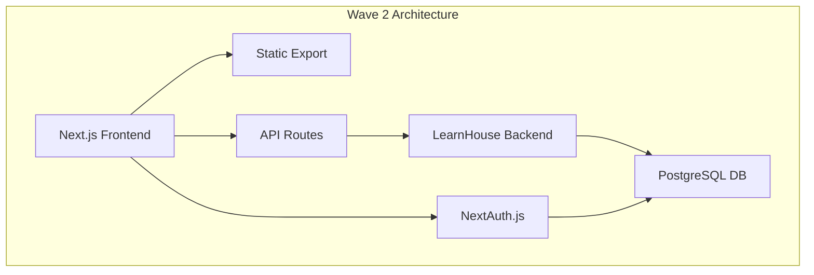

# LMS Conversion Plan: Stuffnthings → LearnHouse Integration

## Executive Summary

**Mission:** Transform the existing Stuffnthings Website-as-a-Service (WaaS) platform into a comprehensive Learning Management System (LMS) using LearnHouse integration while maintaining our core philosophy of "Zero Technical Friction."

**Timeline:** 4-wave implementation over 8-12 weeks  
**Core Principle:** Maintain high-performance, zero-friction experience  
**Target:** Seamless transition from WaaS to LMS without losing existing capabilities  

## Current State Analysis

### Existing Assets & Infrastructure
✅ **High-Performance Foundation**
- Next.js 14 with static export capability
- 95+ PageSpeed optimization
- GitHub Pages deployment pipeline
- Resend email integration (`re_HWVk1EfN_AmTNFXFicUV95eDWyZGX76aD`)

✅ **Content Management System**
- Markdown-based blog system (6 existing posts)
- Gray-matter frontmatter parsing
- SEO-optimized structure
- Responsive design system

✅ **Business Infrastructure**
- Established domain and branding
- Contact form with lead processing
- Documentation system in `/docs/`
- Performance-first architecture

### Current Business Model: WaaS
- **Target:** Small to medium businesses needing high-performance websites
- **Value Prop:** "Zero Technical Friction" - performance without complexity
- **Revenue:** One-time builds + maintenance contracts
- **Content:** Landing page optimization, business websites

## Target State: LearnHouse LMS Integration

### New Business Model: Learning Platform
- **Target:** Course creators, educational businesses, training organizations
- **Value Prop:** "Zero Friction Learning" - powerful LMS without complexity
- **Revenue:** Subscription-based SaaS model + course marketplace commission
- **Content:** Course creation, student management, certification

### LearnHouse Integration Strategy

**LearnHouse Overview:**
- Open-source Learning Management System
- Modern architecture (React/Next.js compatible)
- Course creation and delivery platform
- Student progress tracking
- Assessment and certification tools

**Integration Approach:**
1. **Hybrid Architecture** - Maintain static performance + dynamic LMS features
2. **Progressive Enhancement** - Add LMS capabilities without breaking existing site
3. **API-First Design** - LearnHouse backend + Stuffnthings frontend optimization

## Implementation Waves

### Wave 1: Foundation & Environment Setup (Week 1-2)
**Status: IN PROGRESS (Current subagent task)**

**Objectives:**
- Set up development environment with Context7 integration
- Create comprehensive codebase documentation (CCS spec)
- Analyze current architecture for LMS conversion readiness
- Establish development workflow for subsequent waves

**Deliverables:**
- ✅ `.context/index.md` - CCS-compliant project documentation
- ✅ `.context/tech-stack.md` - Technology stack analysis
- ✅ `docs/LMS-CONVERSION-PLAN.md` - This conversion strategy document
- ✅ Context7 CLI integration for real-time library documentation
- ✅ Development environment verification

**Technical Setup:**
- Context7 installation and configuration
- Current codebase analysis and documentation
- Performance baseline establishment
- LearnHouse research and compatibility assessment

### Wave 2: LearnHouse Core Integration (Week 3-4)

**Objectives:**
- Install and configure LearnHouse backend
- Create authentication system integration
- Set up user management infrastructure
- Maintain existing static export capability

**Deliverables:**
- LearnHouse backend deployment (Docker/cloud)
- NextAuth.js integration for unified authentication
- User roles and permissions system (admin, instructor, student)
- Database schema for courses, users, progress
- API routes for LMS functionality

**Technical Implementation:**
```bash
# LearnHouse installation
git clone https://github.com/learnhouse/learnhouse
docker-compose up -d learnhouse-db learnhouse-api

# Authentication integration
npm install next-auth @next-auth/prisma-adapter
# Configure providers, callbacks, session management
```

**Architecture Evolution:**


### Wave 3: Course Content & Management (Week 5-6)

**Objectives:**
- Implement course creation interface
- Convert existing blog content to course modules
- Create course delivery system
- Build instructor dashboard

**Deliverables:**
- Course authoring interface (rich text editor, video upload)
- Content migration tools (blog posts → course lessons)
- Course catalog and browsing interface
- Instructor dashboard for course management
- Student enrollment and progress tracking

**Content Migration Strategy:**
```typescript
// Existing blog post structure
interface BlogPost {
  title: string;
  excerpt: string;
  date: string;
  author: string;
  content: string;
  tag: string;
}

// New course lesson structure
interface CourseLesson {
  id: string;
  title: string;
  description: string;
  content: string;
  courseId: string;
  order: number;
  duration: number;
  resources: Resource[];
  quiz?: Quiz;
}
```

### Wave 4: Student Experience & Optimization (Week 7-8)

**Objectives:**
- Build student learning interface
- Implement progress tracking and certificates
- Add payment and subscription management
- Performance optimization and testing

**Deliverables:**
- Student dashboard and learning interface
- Progress tracking and completion certificates
- Stripe integration for payments and subscriptions
- Mobile app considerations (PWA)
- Performance optimization (maintain 95+ PageSpeed)

**Business Model Integration:**
- Subscription tiers (Basic, Pro, Enterprise)
- Course marketplace with revenue sharing
- White-label LMS offerings for existing WaaS clients
- Certification and continuing education programs

## Technical Architecture Evolution

### Current Architecture (WaaS)
```
Static Site (Next.js) → Contact API (Express) → Email (Resend)
        ↓
    GitHub Pages
```

### Target Architecture (LMS)
```
Frontend (Next.js SSG/SSR) ↔ API Layer (Next.js API Routes)
                           ↕
                   LearnHouse Backend
                           ↕
                   PostgreSQL Database
                           ↕
              Payment Service (Stripe)
```

### Hybrid Performance Strategy
**Maintain Static Benefits:**
- Course catalog pages: Static generation
- Marketing content: Static export
- Blog content: Static markdown processing

**Add Dynamic Features:**
- User authentication: Server-side sessions
- Course progress: Real-time database updates
- Interactive content: Client-side React components
- Payment processing: Secure API endpoints

## Risk Assessment & Mitigation

### Technical Risks
**Risk:** Performance degradation from dynamic features  
**Mitigation:** Hybrid static/dynamic architecture, aggressive caching

**Risk:** LearnHouse integration complexity  
**Mitigation:** Gradual integration, API-first approach, fallback options

**Risk:** Existing site disruption during migration  
**Mitigation:** Feature flags, parallel development, staged rollouts

### Business Risks
**Risk:** Existing WaaS clients affected during transition  
**Mitigation:** Maintain backward compatibility, communicate changes early

**Risk:** Market fit for LMS transition  
**Mitigation:** Survey existing clients, beta testing program

**Risk:** Technical complexity overwhelming small team  
**Mitigation:** Wave-based approach, external development support if needed

## Success Metrics

### Technical Metrics
- **Performance:** Maintain 95+ PageSpeed scores
- **Uptime:** 99.9% availability during transition
- **Load Time:** <2s course page loads
- **Mobile:** Full mobile compatibility

### Business Metrics
- **User Adoption:** 50+ beta users by Week 4
- **Content Migration:** 100% existing blog content converted
- **Revenue:** First paid subscription within 30 days of launch
- **Client Retention:** 80%+ existing WaaS clients transition to LMS

### User Experience Metrics
- **Ease of Use:** <10 minutes from signup to first course
- **Student Engagement:** 70%+ lesson completion rates
- **Instructor Satisfaction:** 4.5/5 course creation experience rating

## Resource Requirements

### Development Team
- **Frontend Developer:** Next.js, React, TypeScript expertise
- **Backend Developer:** LearnHouse, PostgreSQL, API design
- **DevOps Engineer:** Docker, deployment, performance optimization
- **UX Designer:** Learning experience design, interface optimization

### Infrastructure
- **Hosting:** Upgraded hosting for dynamic content (Vercel Pro or similar)
- **Database:** PostgreSQL instance (managed service recommended)
- **CDN:** Static content delivery network
- **Monitoring:** Performance and error tracking (Sentry, LogRocket)

### Budget Considerations
- **Development:** 200-300 development hours across 4 waves
- **Infrastructure:** $200-500/month for hosting and services
- **Third-party Services:** Stripe (2.9% + 30¢), email services, monitoring
- **Domain/SSL:** Existing infrastructure sufficient

## Communication Plan

### Internal Team
- **Weekly progress reviews** during each wave
- **Technical architecture reviews** before Wave 2 and 4
- **Performance testing** after each wave completion

### Existing Clients
- **Advance notice** (30 days) before major changes
- **Migration assistance** for clients wanting LMS features
- **Grandfathered pricing** for existing WaaS contracts

### New Market
- **Beta program announcement** at start of Wave 3
- **Course creator outreach** targeting existing content creators
- **Educational partnership opportunities** with training organizations

## Next Immediate Actions (Post-Wave 1)

1. **LearnHouse Research Deep-dive**
   - Set up local LearnHouse instance
   - API documentation review
   - Integration point identification

2. **Database Architecture Planning**
   - Schema design for user management
   - Course content data modeling
   - Progress tracking structure

3. **Authentication System Design**
   - NextAuth.js configuration
   - Role-based access control
   - Session management strategy

4. **Performance Baseline Establishment**
   - Current site performance audit
   - Load testing setup
   - Monitoring system implementation

This conversion plan provides a structured approach to transforming Stuffnthings from a Website-as-a-Service platform into a comprehensive Learning Management System while preserving the core "Zero Technical Friction" philosophy that has made the platform successful.